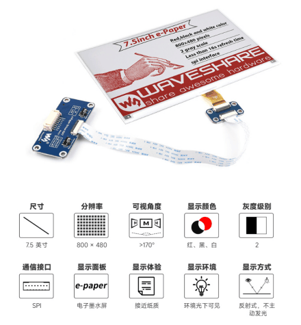
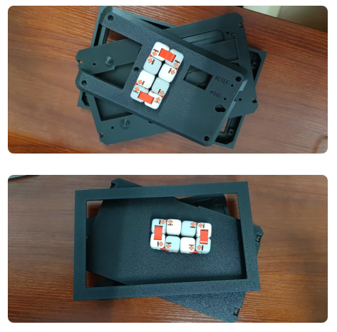
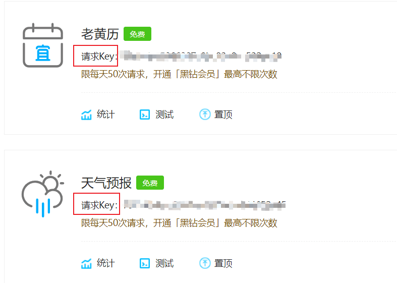

# Portal Calendar

[ZH](./README.md) | EN

## Movtivation
Here is e-paper project motivated by [wuspy/portal_calendar](https://github.com/wuspy/portal_calendar)

When I saw this project, I found it is suitable for chinese lunar calendar. In my family, we still check lunar calendar for family members' birthday or travel plan.

## Directory structure
- **frame** stl files for 3D print
- **img** images for readme
- **resources** static files, eg. fonts, images
- **src** source code

## Materials
**Notification**: If you use amazone, just check the list in [wuspy/portal_calendar](https://github.com/wuspy/portal_calendar). This list is for guys who use Taobao(淘宝)

- **Waveshare 7.5" 800x480 E-Ink display** Avaliable from [waveshare](https://www.waveshare.net/left_column/e-Paper.htm) or from [taobao](https://detail.tmall.com/item.htm?id=633262461077)

- **EzSBC ESP32 breakout board** esp32 can also be bought from taobao, just search it (BTW. it's very cheap, like it)
- **4xAAA battery holder** search it on taobao(AAA battery is an American dry battery standard, and the No.7 battery standard is compatible with it)
- **9x M3x8 cap head screws** same. taobao it
- **frame** print it through 3D printer, or taobao it and send stl file to the online store. here is outlook of my frame

## Implementation
In truth, I'm not good at C/C++. With the development of programme. I can use [MicroPython](https://micropython.org/) solve my problem.  

Actually, in this project, it's not a computationally intensive projects. Micropython can handle it.

But the big problem is no enough docs. sometime we should read some source code.

### Micropython
1. Waveshare does not provide a micropython driver. But we learn and rewrite the python driver code in [waveshare repositore](https://github.com/waveshareteam/e-Paper/tree/master/RaspberryPi_JetsonNano/python)
2. If we want to support Timezone, we'd better check the code writen by [mPython board](https://github.com/labplus-cn). Micropython's [ntptime](https://github.com/micropython/micropython-lib/blob/master/micropython/net/ntptime/ntptime.py) module doee not implement this function.
3. In this project, we must query some requests for network resource(API). Micropython provide a [urequests](https://makeblock-micropython-api.readthedocs.io/en/latest/public_library/Third-party-libraries/urequests.html) module can work for it, but it is not as good as Requests

### Features
Add some functions based on the original project

1. Show content of lunar calender, eg. ‘宜’(some activities you can do), ‘忌’(some activities you can't)
2. Birthday countdown
3. Lunar zodiac image display

## Miscellaneous

### Precautions for waveshare e-paper
When we use this screen, I think we'd better read the [precautions](https://www.waveshare.com/wiki/7.5inch_e-Paper_HAT_Manual#Precautions)

### API
We get data by querying [Juhe Api](juhe.cn)

1. lunar calendar api: https://www.juhe.cn/docs/api/id/65 (50 times per day for free)
2. weather api: https://www.juhe.cn/docs/api/id/73 (50 times per day for free)

### font
[Smiley-sans/得意黑](https://github.com/atelier-anchor/smiley-sans) is a open source fonts we use in this project

