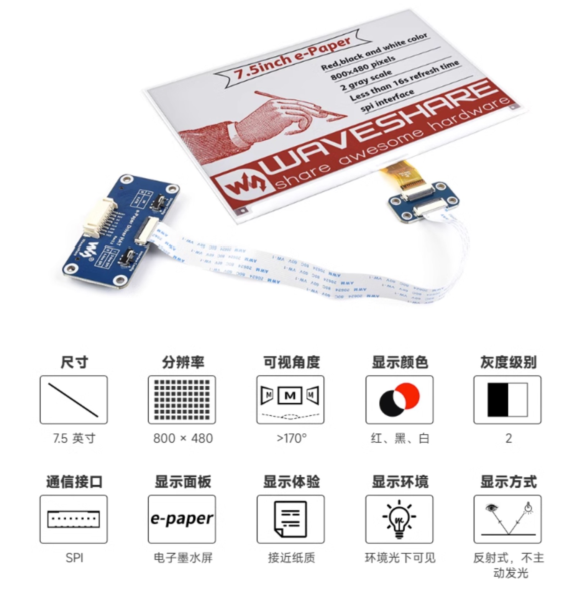

# Portal-Calendar-py

CN | [EN](./README-en.md)

这是一个墨水屏电子日历的项目，原项目地址：[Portal Calendar](https://github.com/wuspy/portal_calendar)

看到这个项目想着感觉更加适合我们的黄历，考虑到自己家里都是过农历生日，还有看黄历的习惯，打算就做一个电子黄历

## 目录结构

- **frame** 原项目的3d打印所需的stl文件
- **img** 项目readme展示需要的图片
- **resources** 静态文件，字体、图片等
- **src**  源码，逻辑代码实现

## 材料

下面都是原版硬件在国内找到的链接，
- **Waveshare 7.5" 800x480 E-Ink display** Waveshare电子墨水屏，可以在taobao搜索：微雪旗舰店（或点击这个[链接](https://detail.tmall.com/item.htm?id=633262461077 = 100)，个人选择的红黑白版本的显示器，想显示黄历）

- **EzSBC ESP32 breakout board** esp32开发板，随便搜索，比较随意，毕竟esp32比较便宜

- **4xAAA battery holder** 电池盒，淘宝搜索即可(**AAA电池**是一种美国的干电池标准，**7号电池**标准与其兼容。)

- **9x M3x8 cap head screws** M3x8帽头螺钉，依旧淘宝搜索一大堆

- **framework** 使用3d打印出来，淘宝3d打印，价格略贵（>￥100）😓

## 实现

> 前人栽树，后人乘凉

本人c/c++能力不够，只能稍微读懂代码，要是写的话还是有点难度。随着技术的发展，[micropython](https://micropython.org/)这种对我比较友好的技术的出现，解决了我个人遇到的难题。
同时在这个电子日历场景下，对于算力以及效率的要求并不高。所以选择micropython进行开发这一项目。

## 黄历api

这里采用聚合数据提供的api：https://www.juhe.cn/docs/api/id/65 （每天免费调用50次）