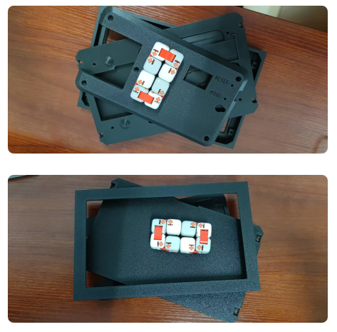

# Portal-Calendar-py

 

CN | [EN](./README-en.md)

## Movtivation

这是一个墨水屏电子日历的项目，原项目地址：[Portal Calendar](https://github.com/wuspy/portal_calendar)

[InkCalendar](https://github.com/13Bytes/eInkCalendar)则是reddit上发布这个项目的第一个，也是motivated了Portal Calendar这个项目，但是InkCalendar项目用到的是Raspberry Pi 3b来驱动整个项目，而且需要一直usb供电，作者本人也觉得只用来处理日历有点杀鸡焉用牛刀了。当然好处在于可以直接参考微雪提供的python驱动。

看到这个项目想着感觉更加适合我们的黄历，考虑到自己家里都是过农历生日，还有看黄历的习惯，打算就做一个电子黄历

## 目录结构

- **frame** 原项目的3d打印所需的stl文件
- **img** 项目readme展示需要的图片
- **resources** 静态文件，字体、图片等
- **src**  源码，逻辑代码实现

## 材料

下面都是原版硬件在国内找到的链接，
- **Waveshare 7.5" 800x480 E-Ink display** Waveshare电子墨水屏，可以在taobao搜索：微雪旗舰店（或点击这个[链接](https://detail.tmall.com/item.htm?id=633262461077)，个人选择的红黑白版本的显示器，想显示黄历）

- **EzSBC ESP32 breakout board** esp32开发板，随便搜索，比较随意，毕竟esp32比Raspberry Pi 3b便宜的不是一星半点。也可以选择微雪提供的esp32模块，这样就不用使用e-paper driver hat了。

- **4xAAA battery holder** 电池盒，淘宝搜索即可(**AAA电池**是一种美国的干电池标准，**7号电池**标准与其兼容)，唯一强迫症就是没有搜到完美的加后盖的电池盒，有后盖的宽度变宽了，而且盖后盖的方式以及方向有点接受不了。

- **9x M3x8 cap head screws** M3x8帽头螺钉，依旧淘宝搜索一大堆（大概2块钱100个）

- **frame** 使用3d打印出来，淘宝3d打印pla材质，下图是打印出来的框架

## 实现

> 前人栽树，后人乘凉

本人c/c++能力不够，只能稍微读懂代码，要是写的话还是有点难度。随着技术的发展，[micropython](https://micropython.org/)这种对我比较友好的技术的出现，解决了我个人遇到的难题。

同时在这个电子日历场景下，对于算力以及效率的要求并不高。所以选择micropython进行开发这一项目（原项目使用的是Arduino）。

难题在于micropython的文档还是不够的，有些地方需要读读源码。希望社区能快速发展起来~

### Hardware connection

[E-Paper Driver HAT](https://www.waveshare.net/wiki/E-Paper_Driver_HAT)进行了升级修改：
1. RST引脚现在只控制复位，不再控制电源通断
2. **增加一个PWR引脚**，用来控制电源通断

所以在这里，我把VCC改成接5v电压，PWR接3.3v电压

| e-paper hat | | esp32 |
| ----- | --- | ---- |
| VCC (Grey) | <--> | 5v |
| GND (Brown) | <--> | GND |
| DIN (Blue) | <--> | IO13 |
| CLK (Yellow) | <--> | IO14 |
| CS (Orange) | <--> | IO15 |
| DC (Green) | <--> | IO23 |
| RST (White) | <--> | IO33 |
| BUSY (Purple)	 | <--> | IO27 |
| PWR (RED) | <--> | 3.3v |

### MicroPython

1. 坏消息是微雪没有提供micropyton的驱动，好消息是可以参考微雪给[Raspberry写的python驱动]( https://www.waveshare.net/w/upload/7/71/E-Paper_code.zip)或者[esp32的arduino示例代码](https://www.waveshare.net/w/upload/5/50/E-Paper_ESP32_Driver_Board_Code.7z)，根据这个改成micropython支持的代码。
2. ntp时间同步需要使用[ntptime模块](https://github.com/micropython/micropython-lib/blob/v1.20.0/micropython/net/ntptime/ntptime.py)，但是ntptime模块，暂时不支持timezone，使用的是UTC时间。要想支持timezone，参考[labplus](https://github.com/labplus-cn)设计的[mPython板子](https://mpython.readthedocs.io/zh/master/)中[ntptime的实现](https://github.com/labplus-cn/mpython/blob/018626912edc47db2a7cb35a63509d5ca1517508/port/modules/ntptime.py)细节
1. micropython提供的[urequests模块]()，具体实现是通过micropython的require()导入自己实现的[requests模块](https://github.com/micropython/micropython-lib/blob/master/python-ecosys/requests/requests/__init__.py)，功能简单，不会像python的requests库那么强大

### 内容修改

1. global.h中的内容迁移至config.py中
2. 新增birth.py，用于存储生日
3. 错误信息处理，统一放到错误处理文件(errors.py)中，主函数进行调用
4. 字体上选择得意黑

### Features

在原项目基础上拓展一些内容

1. 黄历内容的展示，也就是”宜“，”忌“这些内容
2. 生日提示，某某还有几天生日。
3. 农历生肖图像展示

## 其他

### waveshare墨水屏注意事项
这里做一个补充说明，对于墨水屏，[waveshare官网](https://www.waveshare.net/wiki/7.5inch_e-Paper_HAT_Manual)的wiki介绍了注意事项

1. 支持局刷的屏幕，注意使用的时候不能一直用局刷对屏幕进行刷新，需要在做几次局刷之后，对屏幕进行一次全刷清屏。否则会造成屏幕显示效果异常。
2. **注意屏幕不能长时间上电**，在屏幕不刷新的时候，要将屏幕设置成睡眠模式，或者进行断电处理。否则屏幕长时间保持高电压状态，会损坏膜片，无法修复。
3. 使用墨水屏的时候，建议**刷新时间间隔至少是180s**, 并且**至少每24小时做一次刷新**，如果长期不使用墨水屏的话，要将墨水屏刷白存放。（具体储存环境需求参考数据手册）
4. 屏幕进入睡眠模式之后，会忽略发送的图片数据，只有重新初始化才能正常刷新。
5. 控制 0x3C 或 0x50 （具体参照数据手册）寄存器可以调节边框颜色，在例程中可以调节 Border Waveform Control 寄存器或者 VCOM AND DATA INERTVAL SETTING 进行设置。
6. 如果发现制作的图片数据在屏幕上显示错误，建议检查一下图片大小设置是否正确，调换一下宽度和高度设置再试一下。
7. **墨水屏的工作电压要求是 3.3V**，如果您购买的是裸屏的话，设计电路的时候如果需要配合 5V 工作环境的话，建议做一下电平转换处理。新版驱动板（Rev2.1及后续版本）加入了电平处理电路，可以同时支持 3.3V 和 5V 工作环境，老版本只能支持 3.3V 工作环境，使用的时候可以先确认一下版本号（版本号在板名下）。(购买时可以具体询问下厂商，确认下)
8. **屏幕的 FPC 排线比较脆弱**，请注意：不要沿屏幕垂直方向弯曲排线，避免排线被撕裂；不要反复过度弯曲排线，避免排线断裂；不要往屏幕正面方向弯曲排线，避免排线与面板的连接断开。调试研发时建议固定排线后使用。

### api

这里采用聚合数据提供的api

万年历：https://www.juhe.cn/docs/api/id/177 （每天免费调用50次）

天气：https://www.juhe.cn/docs/api/id/73 （每天免费调用50次）

### 字体
[得意黑](https://github.com/atelier-anchor/smiley-sans)

