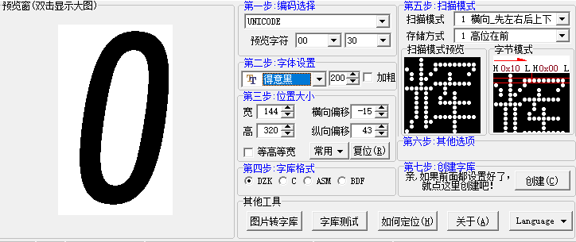

## Description

This readme descripe some functions for each python file.

### Picture cropping
Zodiac picutre(zodiac.png) is download from [图精灵/616pic](https://616pic.com/sucai/14nixpq7z.html), and it's only for this project, **not for commercial use**. 
Get BMP of each chinese zodiac for this pic, run this command line:
``` shell
python cut_zodiac.py
```

### Smiley fonts

There is two way to generate Glyphs I ever tried

**1.** use software which can generate Glyphs



**2.** or use python code provided by [wuspy/portal_calendar](https://github.com/wuspy/portal_calendar) (resources/build_font.py), but i rewriten it for my need. 

[wuspy/portal_calendar](https://github.com/wuspy/portal_calendar#bill-of-materials) mentioned waveshare e-paper is intended only for 2-greay level. He make some hacks to support 4-grey level. But this can't suit for every e-paper. I use 1-bits mode(0 for black, 1 for white) in this project.

> This display is intended only for 2-color greyscale (full black or full white, with no grey levels). However, this code does some hacks to it to make it support 4-color greyscale 
> for better antialiasing. I didn't invent this technique, the GxEPD2 project among others does the same thing. The downside of doing this, however, is that results can vary from 
> display to display. The greyscale levels may not look as good on your particular display as they do on mine. I've tried to design the graphics with that in mind so that the grey 
> level isn't critical to get things to look good, but I've only tried this on two of these displays, and I can't guarantee yours will look perfect.

``` shell
python build_font.py ./SmileySans-Oblique.ttf -name smiley32 -size 32 -ranges 月,日,星,期,周,正,腊,冬,寒,一,二,三,四,五,六,七,八,九,十,初,宜,忌,甲,乙,丙,丁,戊,己,庚,辛,壬,癸,子,丑,寅,卯,辰,巳,午,未,申,酉,戌,亥,鼠,牛,虎,兔,龙,蛇,马,羊,猴,鸡,狗,猪,(,),（,） -fg=0 -bg=255

python build_font.py ./SmileySans-Oblique.ttf -name smiley320 -size 320 -ranges 1,2,3,4,5,6,7 -fg=0 -bg=255
```
